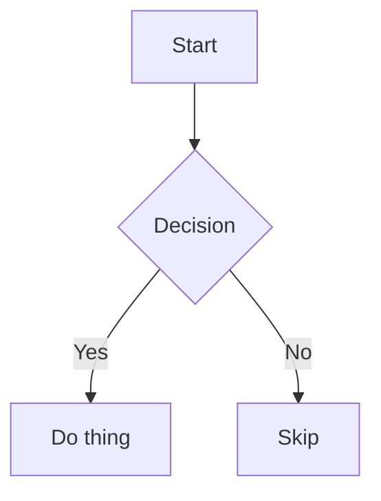

# Obsidian Formatting Reference

Obsidian uses CommonMark + GitHub Flavored Markdown + extensions. This covers Obsidian-specific features and common pitfalls.

## YAML Frontmatter (Properties)

Notes can start with YAML between `---` fences. Obsidian treats these as note properties.

```markdown
---
title: My Note
tags: [project, active]
date: 2026-01-15
status: draft
---
```

Property types: `text`, `list`, `number`, `checkbox`, `date`, `datetime`. Tags in frontmatter don't need `#`.

### Common Pitfalls

**Inline `#` comments truncate values.** YAML interprets `#` as a comment delimiter:
```yaml
# WRONG — Obsidian stores "Files" instead of "[[Files]]"
isAnInstanceOf: "[[Files]]" # KEEP — do not change

# CORRECT — no inline comment
isAnInstanceOf: "[[Files]]"
```

**Wikilinks must be quoted.** Unquoted `[[` and `]]` break YAML parsing:
```yaml
# WRONG
source: [[My Note]]

# CORRECT
source: "[[My Note]]"
related:
  - "[[Note A]]"
  - "[[Note B]]"
```
Obsidian auto-adds quotes in the UI, but when writing programmatically you must add them yourself.

**Tags must contain at least one non-numeric character:**
```yaml
# INVALID — purely numerical
tags:
  - 2025

# VALID
tags:
  - y2025
```
Allowed characters: letters, numbers, `_`, `-`, `/`.

**Property types are not discoverable via CLI.** There is no command to query the assigned type of a property. Refer to existing notes or templates. Known types: `text`, `list`, `number`, `checkbox`, `date`, `datetime`, `tags`.

## Internal Links & Embeds

```markdown
[[Note Name]]                  Link to note
[[Note Name|display text]]     Link with alias
[[Note Name#Heading]]          Link to heading
[[Note Name^block-id]]         Link to block
![[Note Name]]                 Embed entire note
![[image.png]]                 Embed image
![[image.png|300]]             Embed image with width
![[doc.pdf]]                   Embed PDF
```

Pipe characters inside links in tables must be escaped: `[[Note\|alias]]`.

## Callouts

```markdown
> [!note] Optional title
> Content here.

> [!warning]
> This is a warning.

> [!tip]- Collapsed by default
> This content is hidden until expanded.
```

Types: `note`, `abstract`, `info`, `tip`, `success`, `question`, `warning`, `failure`, `danger`, `bug`, `example`, `quote`. Add `-` after type for collapsed, `+` for expanded.

## Highlights, Comments, Strikethrough

```markdown
==highlighted text==
%%comment invisible in reading view%%
~~strikethrough~~
```

## Tags

```markdown
#tag              Inline tag
#nested/tag       Nested tag
```

In frontmatter: `tags: [tag1, nested/tag]` (no `#`).

## Task Lists

```markdown
- [ ] Incomplete task
- [x] Complete task
- [ ] Task with #tag and [[link]]
```

## Tables

```markdown
| Left | Center | Right |
|:-----|:------:|------:|
| a    |   b    |     c |
```

Escape pipes in links/images inside tables with `\|`.

## Math (LaTeX / MathJax)

```markdown
Inline: $e^{i\pi} + 1 = 0$

Block:
$$
\int_0^\infty e^{-x^2} dx = \frac{\sqrt{\pi}}{2}
$$
```

## Diagrams (Mermaid)

````markdown

````

Supports: flowcharts, sequence diagrams, Gantt charts, class diagrams, state diagrams, pie charts, timelines.

## Code Blocks

````markdown
```python
def hello():
    print("world")
```
````

Syntax highlighting via PrismJS. Nest code blocks by using more backticks on the outer block.

## Footnotes

```markdown
Text with footnote[^1] and another[^note].

[^1]: Footnote content.
[^note]: Named footnotes still render as numbers.
```

Inline footnotes: `text^[inline footnote]` (reading view only).

## HTML Pitfalls

- **Unclosed tags break rendering**: `<details>` without `</details>` corrupts everything after it. Always close HTML tags or escape them with `\` or wrap in backticks.
- **Markdown inside HTML is not rendered**: `<div>**bold**</div>` shows literal asterisks.
- **Self-closing tags are fine**: `<br/>`, `<hr/>`.

## Line Breaks

- Single newline in source = continuation of same paragraph in reading view
- Two spaces at end of line + newline = line break (`<br>`)
- Blank line = new paragraph

## Escaping

Backslash escapes special characters: `\*`, `\_`, `\#`, `\|`, `\~`, `\[`, `\]`.

Useful when writing literal characters that Obsidian would otherwise interpret as formatting.
