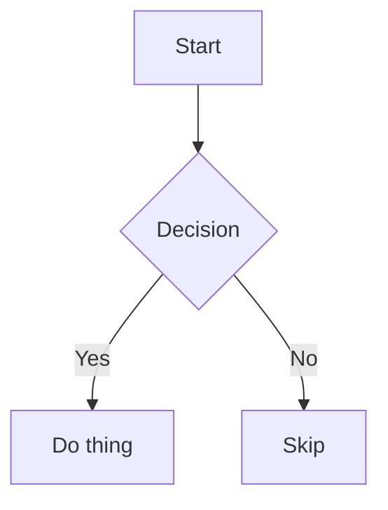

# Formatting Reference

Obsidian uses CommonMark + GitHub Flavored Markdown + Obsidian extensions. This covers all formatting syntax, from basic to advanced.

For internal links, embeds, and aliases: See [links-and-embeds.md](links-and-embeds.md)
For properties and frontmatter: See [properties.md](properties.md)

## Paragraphs & Line Breaks

- Blank line between text creates separate paragraphs
- Single newline = continuation of same paragraph in reading view
- Two spaces at end of line + newline = line break (`<br>`)
- `Shift+Enter` = line break in the editor
- Multiple spaces and blank lines collapse to single space/break
- Use `&nbsp;` for non-breaking space, `<br>` for explicit line breaks

**Strict line breaks** (Settings → Editor): when enabled, single newlines without trailing spaces are joined into one line. With two trailing spaces, lines break but remain in the same paragraph.

## Headings

```markdown
# Heading 1
## Heading 2
### Heading 3
#### Heading 4
##### Heading 5
###### Heading 6
```

## Text Formatting

| Style | Syntax | Result |
|-------|--------|--------|
| Bold | `**text**` or `__text__` | **text** |
| Italic | `*text*` or `_text_` | *text* |
| Strikethrough | `~~text~~` | ~~text~~ |
| Highlight | `==text==` | highlighted |
| Bold + italic | `***text***` or `___text___` | ***text*** |
| Bold + nested italic | `**bold _italic_ text**` | mixed |

## Comments

```markdown
This is an %%inline%% comment.

%%
This is a block comment.
Block comments can span multiple lines.
%%
```

Comments are only visible in Editing view. For export compatibility (e.g. Pandoc), use `<!-- HTML comments -->` instead.

## Callouts

```markdown
> [!note] Optional title
> Content with **Markdown**, [[wikilinks]], and ![[embeds]].

> [!warning]
> Default title is the type name in title case.

> [!tip] Title-only callout
```

### Foldable Callouts

Add `+` (expanded by default) or `-` (collapsed by default) directly after the type:

```markdown
> [!faq]- Collapsed by default
> Hidden until expanded.

> [!info]+ Expanded by default
> Visible, can be collapsed.
```

### Nested Callouts

```markdown
> [!question] Outer
> > [!todo] Inner
> > > [!example] Deepest
```

### Callout Types

| Type | Aliases |
|------|---------|
| `note` | — |
| `abstract` | `summary`, `tldr` |
| `info` | — |
| `todo` | — |
| `tip` | `hint`, `important` |
| `success` | `check`, `done` |
| `question` | `help`, `faq` |
| `warning` | `caution`, `attention` |
| `failure` | `fail`, `missing` |
| `danger` | `error` |
| `bug` | — |
| `example` | — |
| `quote` | `cite` |

Unsupported types default to `note` styling.

## Tags

```markdown
#tag                   Inline tag
#nested/tag            Nested tag (hierarchies)
```

In frontmatter, tags don't use `#`:

```yaml
tags:
  - project
  - nested/subtag
```

**Rules:** Must contain at least one non-numeric character. Allowed: letters, numbers, `_`, `-`, `/`. Case-insensitive.

## Task Lists

```markdown
- [ ] Incomplete task
- [x] Complete task
- [-] Cancelled task
- [?] Question task
```

Nested tasks:

```markdown
- [ ] Parent task
    - [ ] Subtask 1
    - [x] Subtask 2
```

## Lists

```markdown
- Unordered (also * or +)
  - Nested item

1. Ordered
   1. Nested ordered

1) Alternative ordered syntax
```

Use `Shift+Enter` for line breaks within list items without breaking numbering.

## Tables

```markdown
| Left | Center | Right |
|:-----|:------:|------:|
| a    |   b    |     c |
```

- Header row must have at least two hyphens per column
- Align with `:` — left `:--`, center `:--:`, right `--:`
- Escape `|` in links/images inside tables with `\|`
- Cells don't need perfect alignment
- In Live Preview, right-click for table editing context menu

```markdown
| Link | Image |
|------|-------|
| [[Note\|display]] | ![[img.png\|200]] |
```

## Code

### Inline

```markdown
Text with `inline code` here.
```

For backticks inside inline code, use double backticks: ``` ``code with ` backtick`` ```.

### Code Blocks

````markdown
```python
def hello():
    print("world")
```
````

Syntax highlighting via PrismJS. Common languages: `python`, `javascript`, `js`, `typescript`, `ts`, `bash`, `shell`, `json`, `yaml`, `css`, `html`, `sql`, `rust`, `go`, `java`, `c`, `cpp`.

### Nesting Code Blocks

Use more backticks (or tildes) on the outer block than the inner:

`````markdown
````md
```js
console.log("nested")
```
````
`````

You can also mix backticks and tildes for nesting.

## Math (LaTeX / MathJax)

Inline: `$e^{i\pi} + 1 = 0$`

Block:

```markdown
$$
\int_0^\infty e^{-x^2} dx = \frac{\sqrt{\pi}}{2}
$$
```

Uses MathJax with LaTeX notation. Reference: [MathJax basic tutorial](https://math.meta.stackexchange.com/questions/5020).

## Diagrams (Mermaid)

````markdown

````

Supports: flowcharts, sequence diagrams, Gantt charts, class diagrams, state diagrams, pie charts, timelines.

Internal links in diagrams: add `class NodeName internal-link;` to make nodes clickable.

For special characters in node names, use double quotes: `A["⨳ special"]` or `class "⨳ special" internal-link`.

## Footnotes

```markdown
Text with footnote[^1] and named[^note].

[^1]: Footnote content.
[^note]: Named footnotes render as numbers.
[^2]: Multi-line footnote.
  Indent continuation lines with 2 spaces.
```

Inline footnotes (reading view only):

```markdown
Text with inline footnote.^[This is inline.]
```

## Horizontal Rules

Three or more of `***`, `---`, or `___` on their own line.

## Quotes

```markdown
> Blockquote text.
> Can span multiple lines.
```

## Escaping

Backslash escapes special characters: `\*`, `\_`, `\#`, `\|`, `\~`, `\[`, `\]`, `` \` ``

For numbered lists that shouldn't auto-format: `1\.` (escape the period).

## HTML in Notes

Obsidian supports sanitized HTML. `<script>` and other dangerous elements are stripped.

### Useful HTML

```html
<u>Underlined text</u>
<br> or <br/>                           Line break
<span style="font-family: cursive">text</span>   Custom styling
<iframe src="https://example.com"></iframe>        Embed web page
<!-- HTML comment (works in exports) -->
```

### HTML Limitations

- **Unclosed tags break rendering**: `<details>` without `</details>` corrupts everything after it. Always close tags, escape with `\<tag>`, or wrap in backticks.
- **Markdown inside HTML is not rendered**: `<div>**bold**</div>` shows literal asterisks. This is intentional for performance.
- **HTML blocks must be self-contained**: No blank lines within an HTML block. Blank lines break the block.

```html
<!-- WORKS -->
<table>
<tr><td>Content</td></tr>
</table>

<!-- BROKEN — blank lines split the block -->
<table>

<tr><td>Content</td></tr>

</table>
```

- `<span>` and `<a>` may appear to render Markdown, but this is the Markdown processor working outside the HTML context, not true HTML+Markdown mixing.

## Attachments

Supported file formats can be added to the vault by copy-paste, drag-and-drop, or saving directly. Default attachment location is configurable under Settings → Files & Links → Default location for new attachments:

- Vault folder (root)
- Specified folder
- Same folder as current file
- Subfolder under current folder
